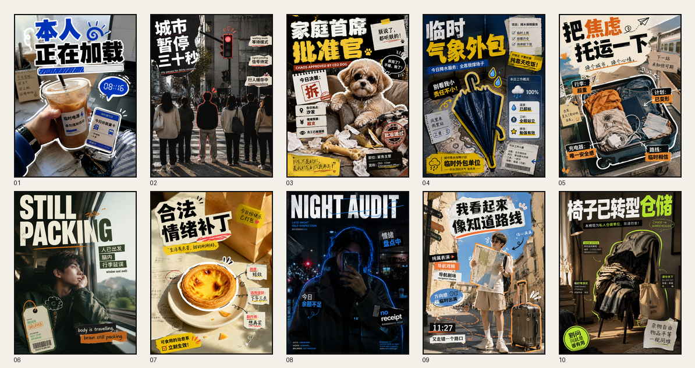

# FANTASY-qiqiguaiguai

把朋友圈碎片、随手拍、宠物、物件、人物、街拍和旅行素材，整理成一张有幽默感、黑色幽默、玩梗气质和编辑设计感的社交内容海报。



## Tags

`codex-skill` `social-media` `poster-design` `wechat-moments` `editorial-design` `image-generation` `3x4-poster` `humor` `black-humor` `collage` `portrait-editorial` `street-photography` `pet-content` `travel-poster` `chinese-typography`

## What It Does

This skill helps Codex turn loose everyday fragments into a postable visual concept:

- 从碎片素材中提炼一个明确主题，而不是复述图片内容。
- 自动选择 T1 / T2 / T3 视觉模板。
- 生成主标题、辅助标签、朋友圈正文和短视觉简报。
- 支持 3:4 竖版社交海报思路，适合朋友圈、小红书封面、故事图、日常内容封面。
- 默认处理隐私风险，例如手机号、地址、订单号、二维码、真实姓名和聊天内容。

## Core Templates

### T1 Portrait Editorial

用于人物是绝对主角的场景。

Examples:

- 电梯自拍、橱窗自拍、车窗人像。
- 双人合照、朋友聚会、旅行人像。
- 需要保留人物身份、五官、穿搭和姿态的编辑封面。

Typical style:

- 英文大标题 + 少量中文补刀。
- 人物压住标题或标题穿插在人物背后。
- 杂志封面感，轻度幽默，不变成商业广告。

### T2 Object Collage

用于杂物、宠物、票据、早餐、办公桌、旅行碎片等素材。

Examples:

- 宠物 + 账单 + 家具损坏。
- 早餐 + 闹钟 + 打车截图。
- 伞、蛋挞、咖啡、行李箱、票据等生活物件。

Typical style:

- 中文强标题。
- 3-6 个功能性信息块。
- 财务报表、事故档案、生存说明书、公司 KPI、观察记录等统一隐喻。
- 可加入贴纸描边、箭头、红章、票据纹理和局部放大。

### T3 Image Overlay Editorial

用于单张照片本身氛围强、构图完整、不适合拆碎重组的场景。

Examples:

- 街拍、地铁、雨夜便利店、旅行路口。
- 第一人称随拍、城市观察、房间角落。
- 一句标题即可改变图片含义的完整照片。

Typical style:

- 保留完整照片作为底图。
- 巨大中文标题覆盖画面，但不遮挡唯一识别点。
- 小字克制，保留安静区域。

## Example Prompts

### 直接出图

```text
使用 FANTASY-qiqiguaiguai，把一张第一人称手持咖啡随拍做成 3:4 朋友圈海报。
主题不要写“喝咖啡”，而是把咖啡当成“本人正在加载”的临时电源。
可以加入一些白色贴纸描边和蓝黑编辑风格。
```

### 多图碎片整理

```text
使用 FANTASY-qiqiguaiguai，把猫、罐头、抓坏的椅子和宠物账单整理成一张幽默海报。
默认自动选模板，输出朋友圈正文和图像生成提示词。
```

### 先给方案

```text
使用 FANTASY-qiqiguaiguai，先给我 3 个角度。
素材是：雨伞、便利店小票、下雨街道、迟到截图。
```

## Installation

Clone this repository into your Codex skills folder:

```powershell
git clone https://github.com/dacnay816y62-hub/fantasy-qiqiguaiguai-skill.git `
  "$env:USERPROFILE\.codex\skills\fantasy-qiqiguaiguai"
```

Or copy the folder manually so that `SKILL.md` is at:

```text
~/.codex/skills/fantasy-qiqiguaiguai/SKILL.md
```

Restart Codex or open a new task so the skill list refreshes.

## Recommended Image API Settings

If you use an OpenAI-compatible image API, request a native 3:4 vertical size when possible.

Known working example from testing:

```text
model: gpt-image-2
size: 768x1024
actual returned size: 1086x1448
ratio: 3:4
```

Avoid generating a square image and cropping later when the user explicitly asks for native 3:4 output.

## Privacy Defaults

For screenshots, receipts, order pages, tickets, medical documents, door cards, maps or chats:

- Do not copy real private text.
- Blur or replace phone numbers, addresses, names, order IDs and QR codes.
- Keep only the visual structure, information density and emotional relationship.
- Treat private information as a design texture, not readable content.

## Repository Structure

```text
.
├── SKILL.md
├── agents/
│   └── openai.yaml
├── references/
│   └── visual-generation.md
├── examples/
│   ├── direct-3x4/
│   └── direct-3x4-contact-sheet.png
├── docs/
│   ├── usage.md
│   └── tags.md
└── README.md
```

## License

MIT. See [LICENSE](LICENSE).
