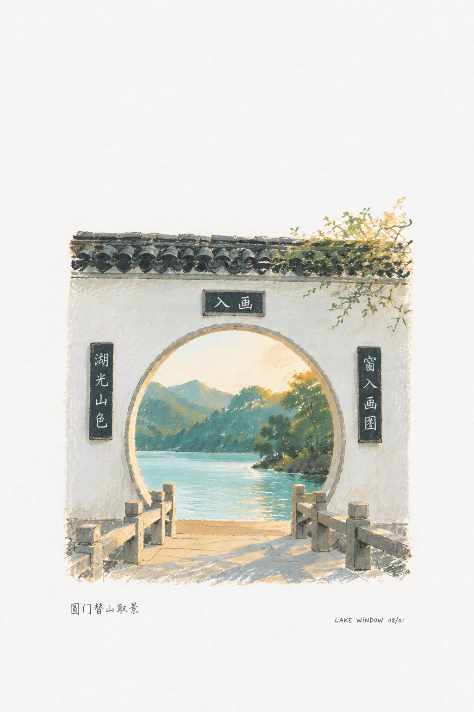
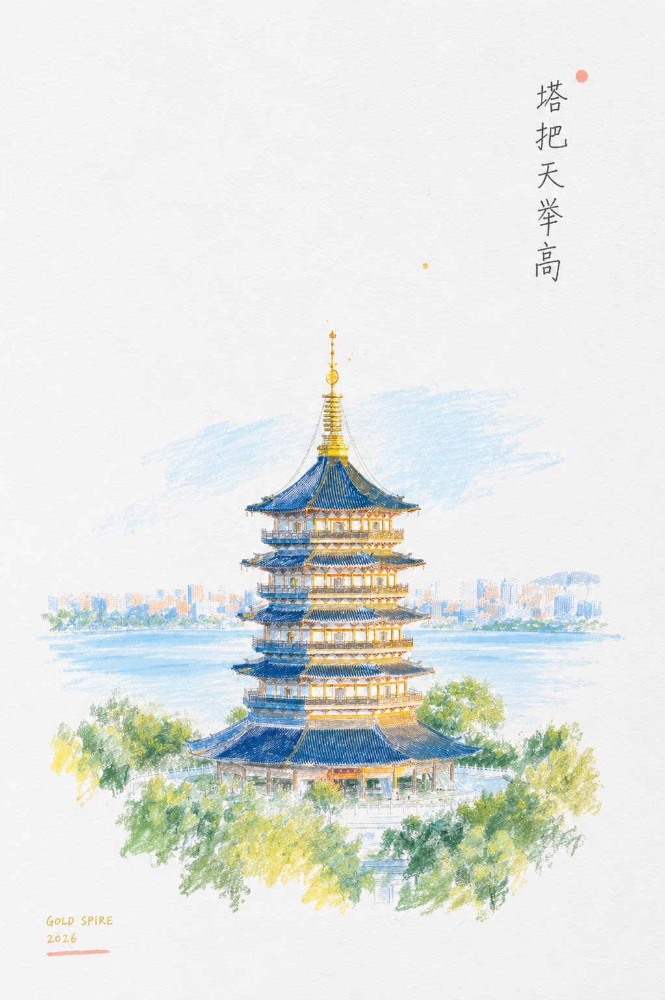
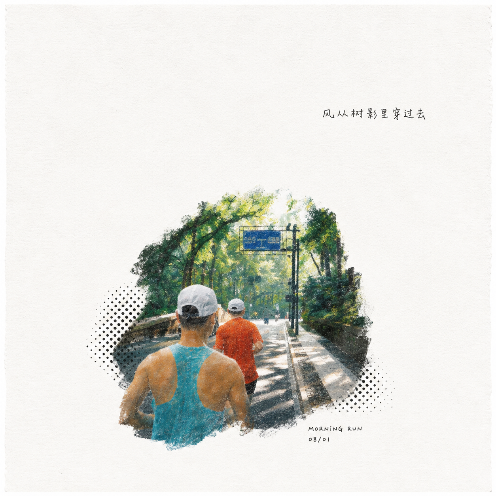
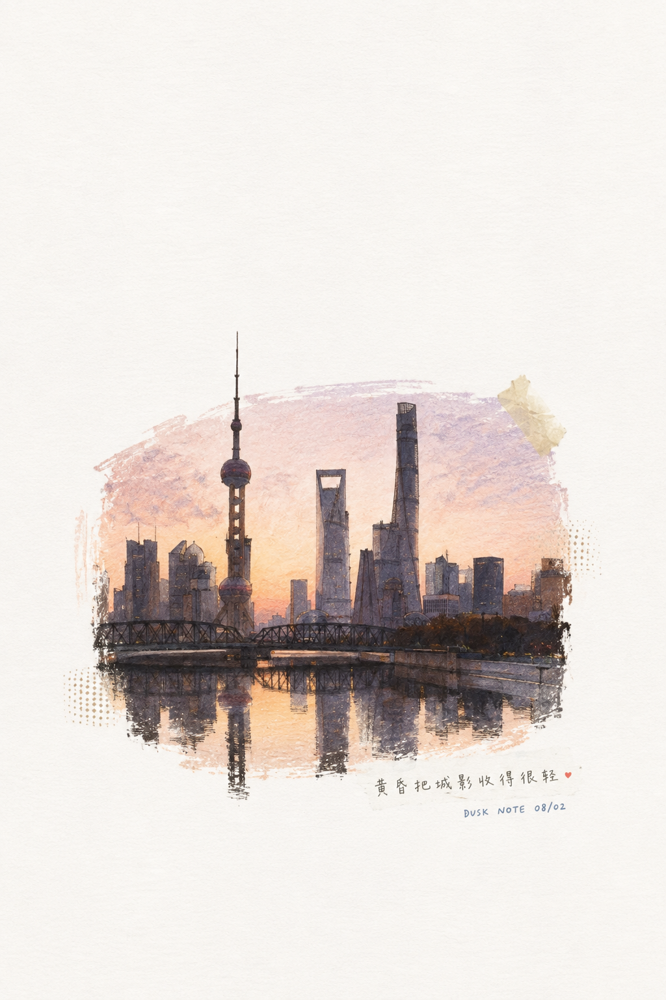
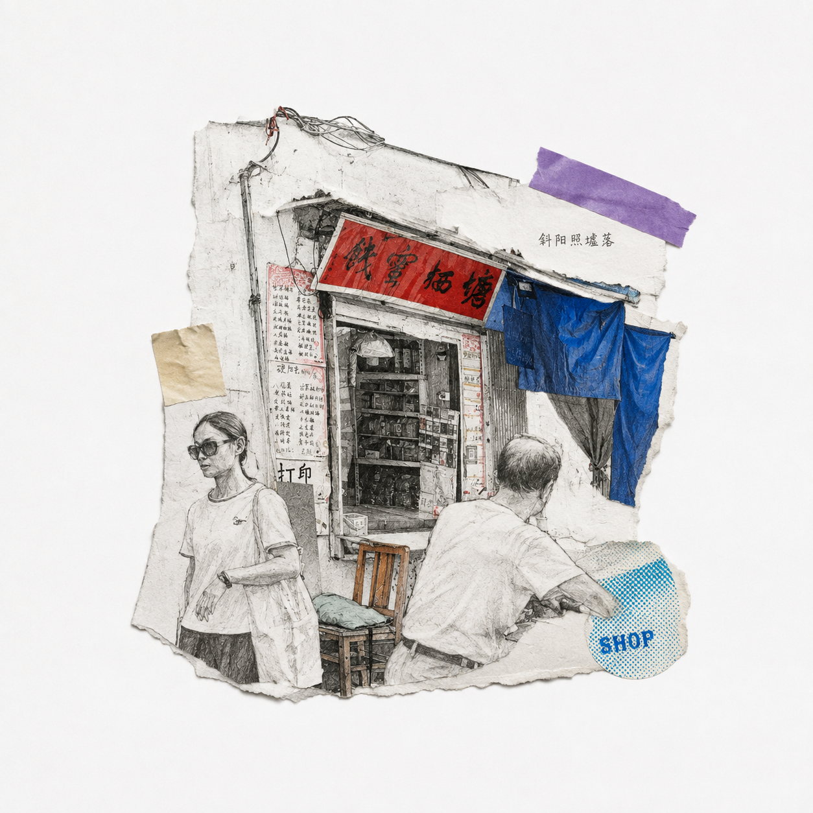
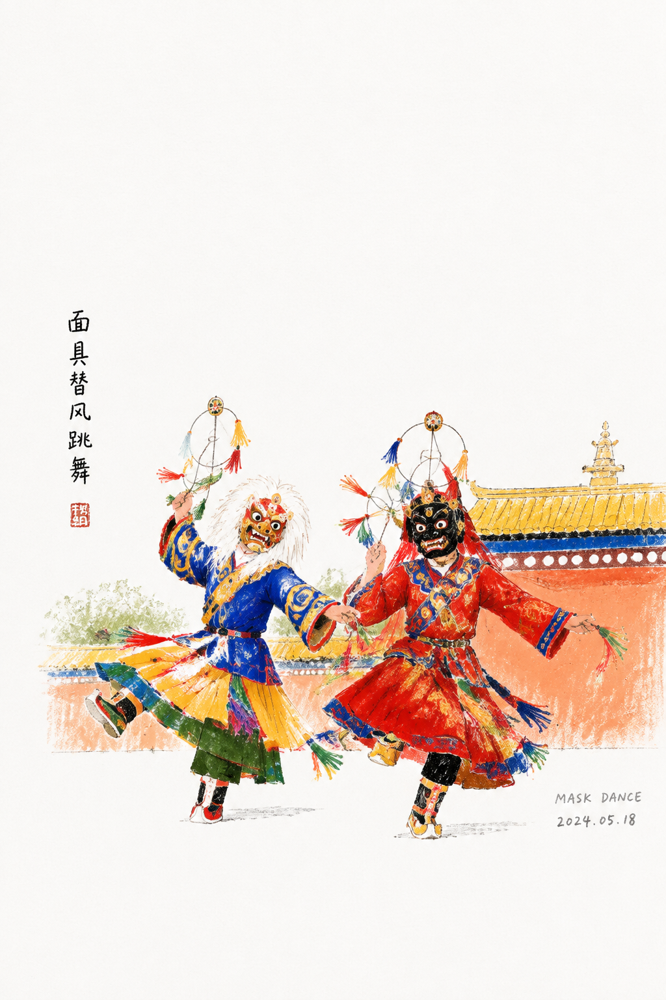
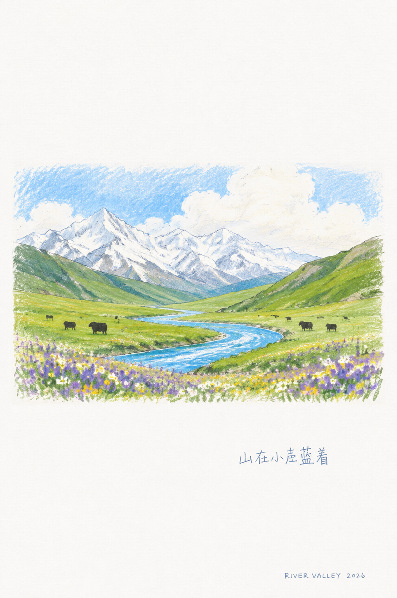

# 废片焕新 · Photo Revival

**FANTASY / 梵想美学 · 摄影与照片转译**

把生活照片转译成白纸上的小幅手绘，保留记忆点，以大量留白与少量诗性文字重新组织画面。

**[快速开始](#start)** · **[下载与安装](#install)** · **[完整规则](SKILL.md)** · **[全部视觉 Skills](https://github.com/dacnay816y62-hub?tab=repositories)**

| 视觉示例 01 | 视觉示例 02 |
| :---: | :---: |
|  |  |

<a id="start"></a>

## 一分钟开始

| 你提供 | 这套 Skill 组织的交付 |
| --- | --- |
| 生活随拍、物件、街角或旅行照片 | 3:4 白纸手绘插画页，主体小、留白多 |

```text
用 $photo-revival 把这张照片重新画成白纸上的小幅水彩手绘。保留主体与空间关系，主体约占整页 10–16%，文字只留一句很小的中文批注。
```

**生成说明：** Skill 组织设计判断、提示词与执行流程；图片由当前环境中可用的图像工具生成或编辑。示例用于理解视觉方向，具体来源以本仓库记录为准，不能据此保证每次得到相同效果。

<a id="install"></a>

## 下载与安装

**[下载当前分支 ZIP](https://github.com/dacnay816y62-hub/photo-revival/archive/refs/heads/main.zip)** · **[阅读 Skill 规则](SKILL.md)**

1. 下载并解压仓库。
2. 将仓库根目录（包含 `SKILL.md`）放入当前助手支持的技能目录。
3. 安装文件夹命名为 **`photo-revival`**，确保入口是 `photo-revival/SKILL.md`。
4. 在支持技能调用的会话中使用 **`$photo-revival`**。如果列表未刷新，新开一个任务。

Codex CLI / IDE 的用户级目录是 `~/.agents/skills/`，项目级目录是 `.agents/skills/`；Windows 用户目录可写为 `%USERPROFILE%\.agents\skills\`。以 [OpenAI 官方安装说明](https://learn.chatgpt.com/docs/build-skills#where-codex-loads-local-skills) 为准。ChatGPT 与其他宿主请按各自的技能加载方式使用。

仓库名与调用名可能不同，以上以 `SKILL.md` 中的名称为准。安装不包含图像服务、账户或生成额度；实际出图取决于你使用的环境。

---

## 核心效果

- 3:4 竖构图
- 白色或近白纸张底图
- 80-88% 大面积留白
- 主体插画只占画面 10-16%
- 主体最大不超过整页 18%
- 色彩只集中在这一小块插画区域
- 手绘笔触：铅笔、水彩、干刷、蜡笔、轻微 risograph 颗粒
- 少量中英文手写小字、日期、field note

一句话：**把照片重新画成一页诗，而不是把照片修成插画。**

## 适合做什么

- 随手拍、废片、日常照片
- 小猫、食物、杯子、窗户、楼道、旧店、街角
- 旅行碎片、建筑、树、桥、庭院、器物
- 传统文化、非遗、民俗、手作、地方记忆
- 想保留真实主体，但希望画面变得更文艺、更轻、更有纸感

## 不适合做什么

- 写真人像精修
- 商业产品大海报
- 大标题视觉海报
- 满版拼贴
- 密集信息图
- 需要严格还原原照片像素的修复任务

## 中文操作指南

下面是从安装到出图的一套完整中文流程。

## 基础用法

在 Codex 里上传一张照片，然后像平常聊天一样说就行：

```text
用 $photo-revival，把这张照片画成那种白纸留白的小手绘插画。
```

稍微具体一点可以这样说：

```text
用 $photo-revival 处理这张照片，保留主体和氛围，但重新画成大留白、白纸质感、带一点诗意小字的手绘插画。
```

如果要批量测试，可以说：

```text
用 $photo-revival 随机测试这几张照片，每张都保持白纸大留白，小小一块手绘插画，文字少一点、有诗气一点。
```

默认情况下，这个 skill 会自己控制比例：主体很小、留白很多、颜色集中在局部。只有结果跑偏时，才需要使用下面的更严格提示词。

## 推荐工作流

1. 上传照片。
2. 先识别照片里最重要的 1-3 个记忆点。
3. 保留这些记忆点：主体、姿态、空间关系、关键物件、情绪。
4. 用图像生成重新绘制，不要做本地滤镜或简单风格迁移。
5. 输出 3:4 竖图。
6. 检查主体是否过大。如果超过 18%，重新生成。
7. 检查文字是否过大、重复、乱码。如果有问题，重新生成或减少文字。

## 通用提示词模板

```text
Transform the reference photo into a 3:4 vertical poetic hand-drawn illustration page on clean white textured paper.

Preserve:
<照片中必须保留的主体、姿态、空间、物件、氛围>

Redraw:
Turn the photo into a fresh hand-drawn illustration, not a photorealistic edit and not a filter.

Composition:
The illustrated subject occupies only 10-16% of the full page, absolute maximum 18%.
Keep 80-88% of the page as untouched blank white paper.
Place the small illustration slightly below center or gently off-center.

Texture:
Use pencil line, watercolor wash, dry brush, wax pastel edges, light print grain, and subtle paper texture.

Color:
Use vivid color only inside the small illustrated area.
Do not spread color into the blank white-paper field.

Text:
Add tiny handwritten caption: "<一句短中文诗句>"
Add tiny English note: "<FIELD NOTE / DATE>"
The text must be very small, handwritten, imperfect, and part of the image.

Avoid:
full-bleed photo, photo-filter look, large portrait crop, subject larger than 18%, dense collage, old yellow paper, big typography, duplicated text.
```

## 示例文案

可以把中文小字写得短一点，像页边批注：

- 圆镜里藏着今天
- 猫把夜晚抱住
- 风从旧店门口经过
- 蓝里藏着风
- 一剪春天醒了
- 竹声很轻
- 影子也会唱戏

英文小字适合做成档案感：

- `FIELD NOTE / 08.02`
- `SOFT MEMORY`
- `PAPER STUDY`
- `QUIET ROOM`
- `HAND MEMORY`
- `DAILY ARCHIVE`

## 样张画廊

| | | |
|---|---|---|
| <br/>汽车页 | <br/>花树 | <br/>月洞门 |
| <br/>相机笔记 | <br/>泡泡 | <br/>塔 |
| <br/>红色自行车 | <br/>跑步者 | <br/>城市天际线 |
| <br/>一碗食物 | <br/>道路记忆 | <br/>旧店 |
| <br/>床上的猫 | <br/>面具舞 | <br/>车窗 |
| <br/>山与牦牛 | <br/>田野笔记 | |

## 常见问题

### 主体太大怎么办？

重新生成，并把约束写得更硬：

```text
The illustrated subject must occupy only 10-16% of the full page.
Absolute maximum subject area is 18%.
Keep 80-88% of the page blank white paper.
```

### 文字重复或乱码怎么办？

减少文字，只保留一句中文和一个英文日期。文字必须“小、少、像手写批注”，不要当成海报标题。

### 生成结果像照片滤镜怎么办？

强调：

```text
This must be newly redrawn as an illustration, not a filtered version of the photo.
```

### 颜色铺太满怎么办？

强调：

```text
Color must stay localized inside the tiny illustrated area.
The blank paper field remains white.
```

## 文件说明

- `SKILL.md`：Codex skill 的核心指令。
- `agents/openai.yaml`：Codex 展示用元数据。
- `examples/`：公开样张。

## License

MIT

## FANTASY / 梵想美学

**让想象先被看见。** 将视觉判断与创作流程整理成可以继续使用的方法。

**[浏览全部视觉 Skills](https://github.com/dacnay816y62-hub?tab=repositories)** · [Street Photo Illustration](https://github.com/dacnay816y62-hub/street-photo-illustration-skill) · [FANTASY Minimal Magazine](https://github.com/dacnay816y62-hub/FANTASY-Minimal-Magazine)
