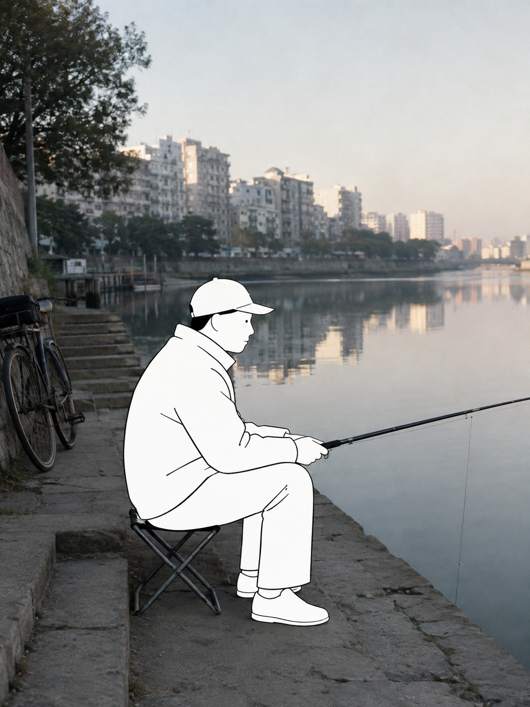
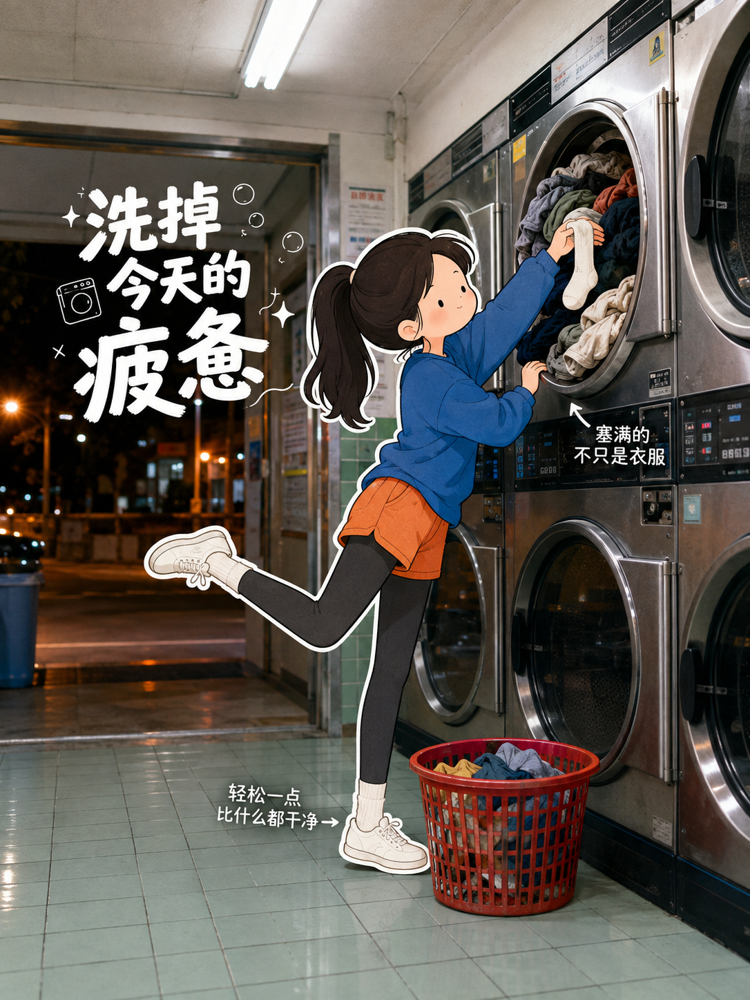
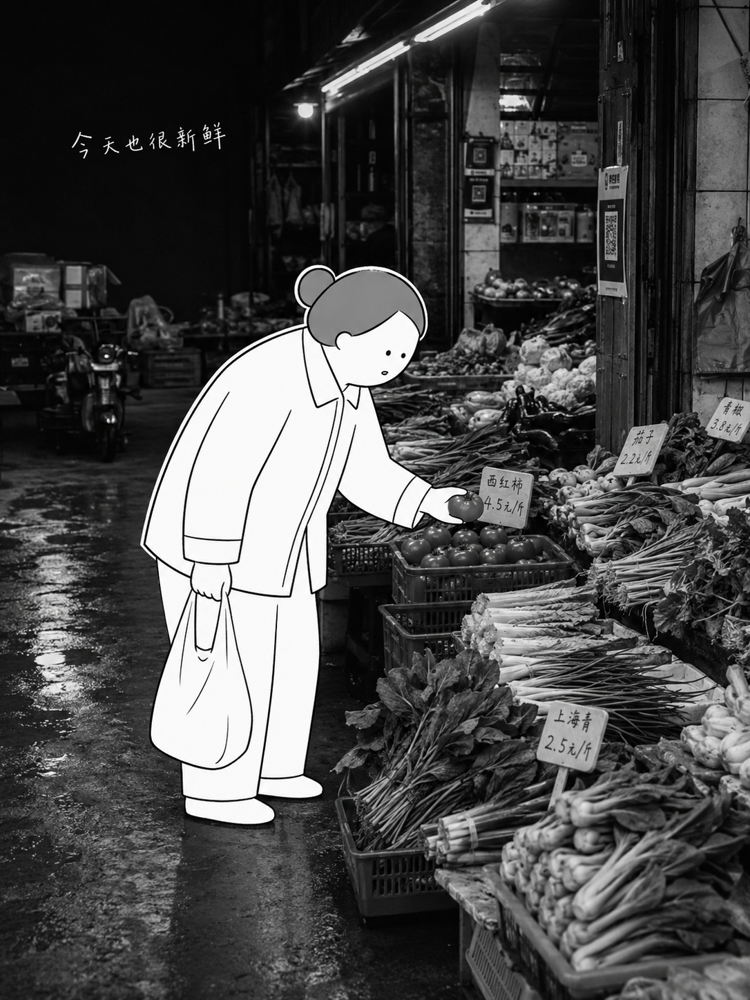
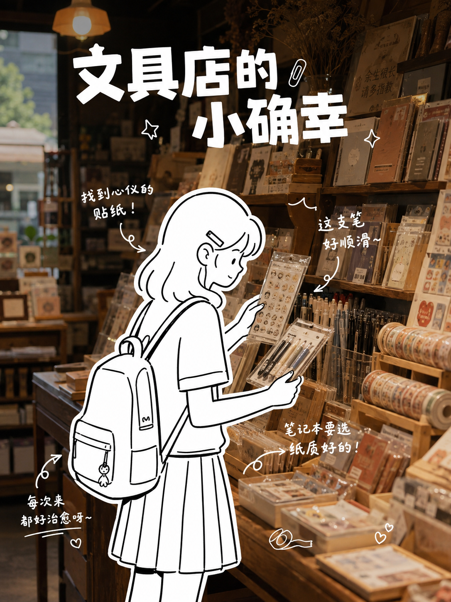
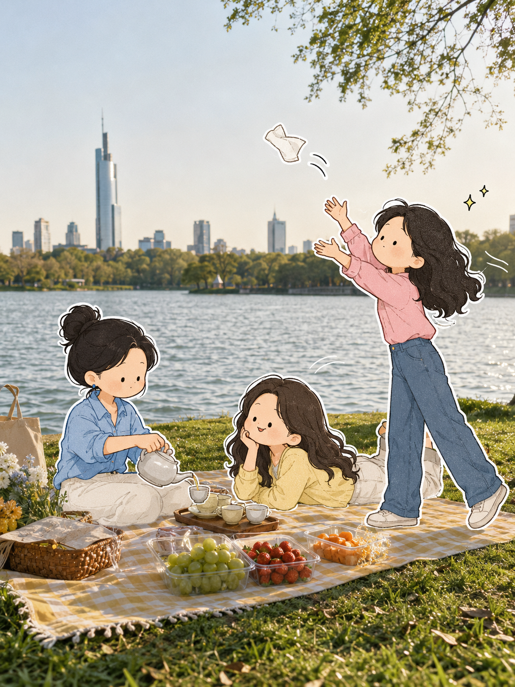
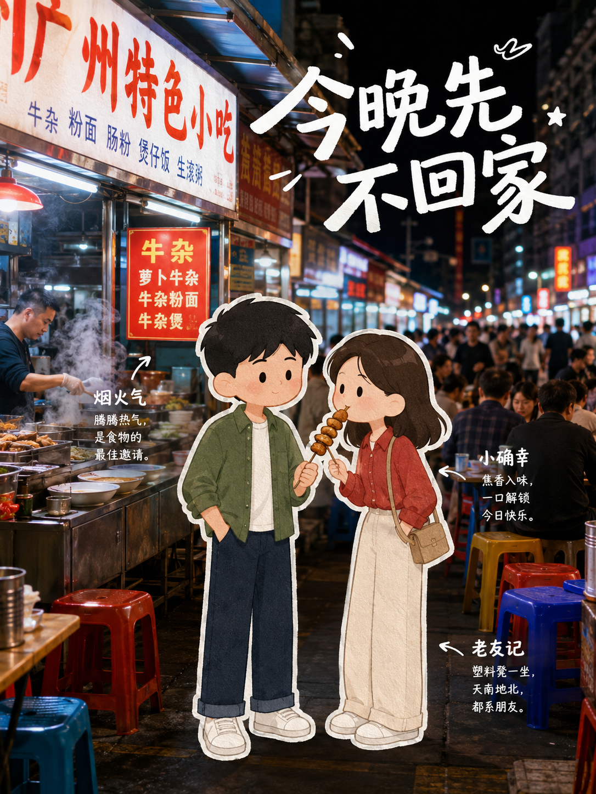
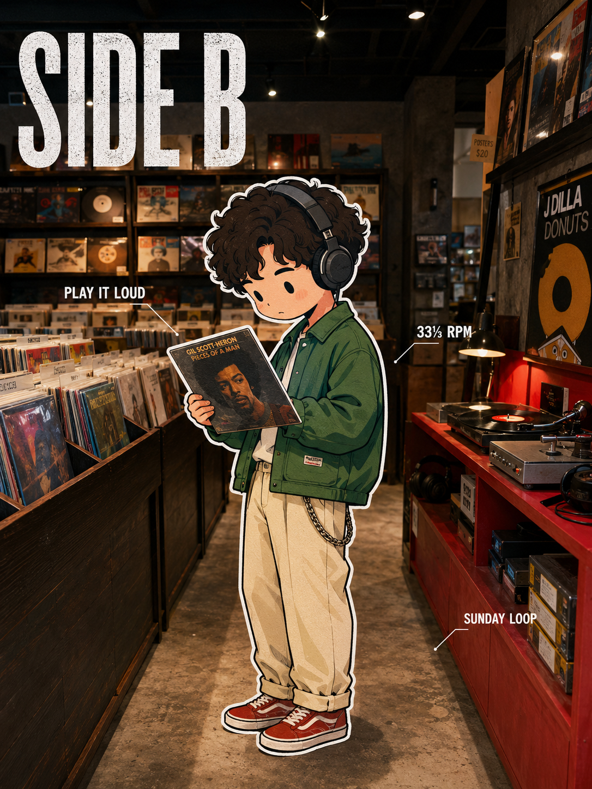
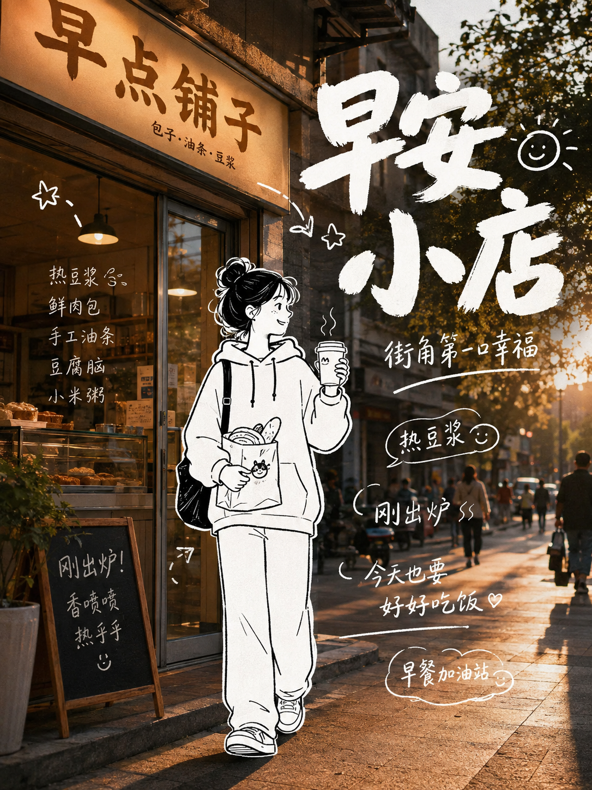
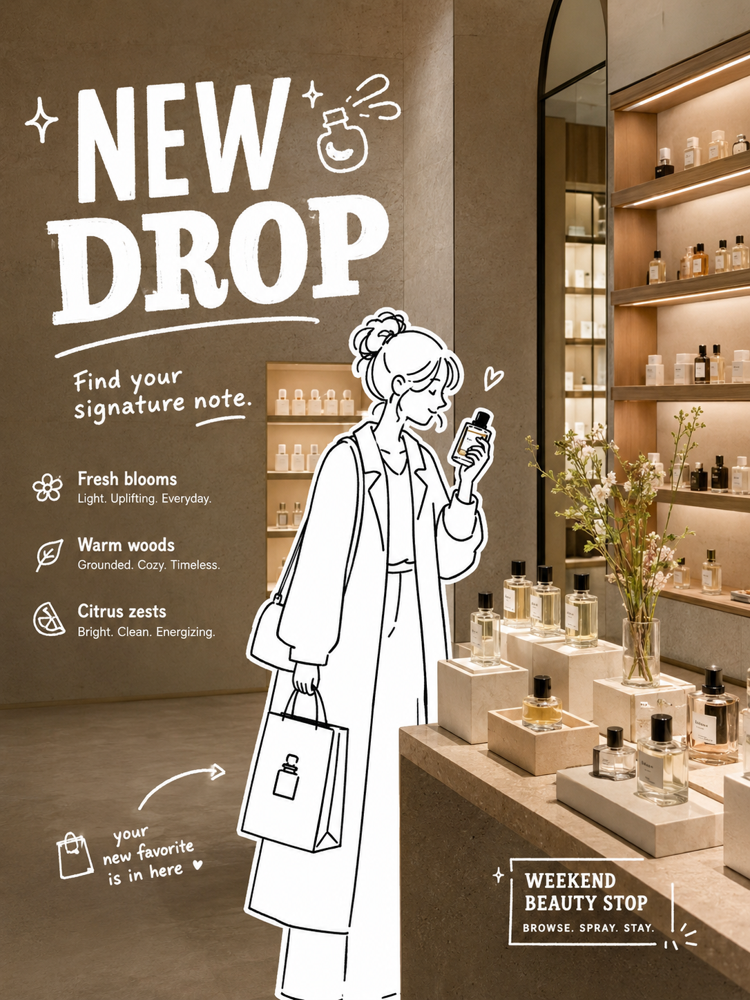
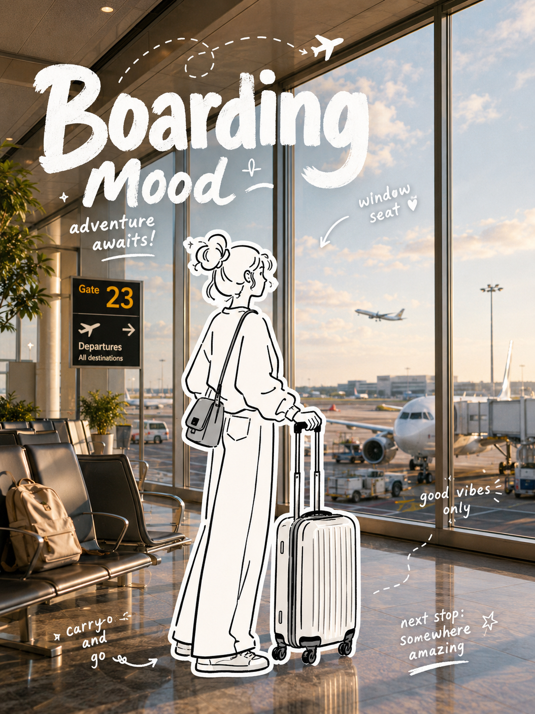

# Street Photo Illustration

把街拍、旅行、生活方式、商业空间照片里的「人」改成黑白线稿或彩色 editorial chibi，同时保留真实环境、动作关系和画面氛围。

## What it does

- 只改人，不改环境
- 支持两种人物风格：`BLACK INK` 和 `COLOR CHIBI`
- 适合街景、河边、公园、夜市、杂货店、地铁、机场、书店、洗衣房、咖啡店等真实照片
- 保留姿势、服装轮廓、配饰、手持物与场景透视
- 可选环境感文案与轻量涂鸦

## How to use

Use `$street-photo-illustration` to transform the people in this photo while keeping the real environment unchanged.

Templates:

- `prompts/black_ink_template.md`
- `prompts/color_chibi_template.md`

## Modes

### BLACK INK

黑白手绘、线条清爽、人物更像贴进照片里的纸感角色。

### COLOR CHIBI

彩色、轻松、编辑感更强，适合生活方式、旅行、商业空间和社交内容。

## Examples

### BLACK INK

<table>
  <tr>
    <td width="50%">
      
       <strong>River / fishing</strong>
    </td>
    <td width="50%">
      
       <strong>Laundry scene</strong>
    </td>
  </tr>
  <tr>
    <td width="50%">
      
       <strong>Market browsing</strong>
    </td>
    <td width="50%">
      
       <strong>Stationery shop</strong>
    </td>
  </tr>
</table>

### COLOR CHIBI

<table>
  <tr>
    <td width="50%">
      
       <strong>Picnic / lake side</strong>
    </td>
    <td width="50%">
      
       <strong>Night market</strong>
    </td>
  </tr>
  <tr>
    <td width="50%">
      
       <strong>Record store</strong>
    </td>
    <td width="50%">
      
       <strong>Breakfast street</strong>
    </td>
  </tr>
  <tr>
    <td width="50%">
      
       <strong>Beauty / retail</strong>
    </td>
    <td width="50%">
      
       <strong>Airport / boarding</strong>
    </td>
  </tr>
</table>

## Repository layout

- `SKILL.md`: core skill instructions
- `agents/openai.yaml`: UI metadata
- `prompts/`: mode-specific prompt templates
- `assets/icon.svg`: skill icon
- `examples/`: sample outputs for the README

## Tags

`street-photo-illustration` `photo-illustration` `editorial-illustration` `black-ink` `color-chibi` `character-replacement` `environment-preserving` `typography` `prompt-skill` `codex-skill`
